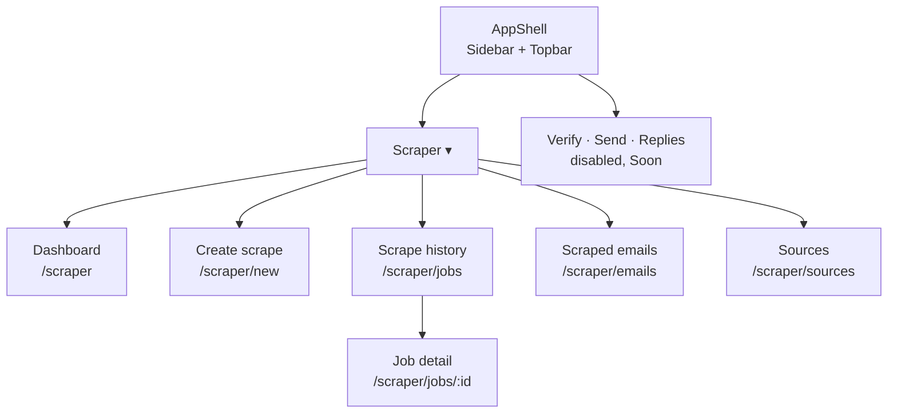

# Scraper Dashboard Build Plan

2026-09-19 · @Someone

Two repos, two plans: this tab is the front end (Vue + shadcn-vue + Tailwind); the back end (Go) is in [Backend plan (outreach-be)](file/cade468b-bd60). Scope is the scraper module only; sending, verification and reply triage come later.

## Scope & repo naming

Build only the **Scraper** module now, but lay the nav and API so Verify, Send and Replies slot in later without a rewrite.

**Repos:** `karvon-fe` and `karvon-be` (*karvon* = caravan; keep the `-fe` / `-be` suffix everywhere: repo, Docker image, env prefix `KARVON_`).

**In scope (v1):**

- Side nav with a **Scraper** group containing: Dashboard (module overview), Create scrape, Scrape history, Scraped emails, Sources.
- Create and run a scrape job (search terms × locations → Google Maps listings → website email crawl).
- Watch job progress live; cancel a job.
- Browse, filter, dedupe and export the resulting businesses and emails as CSV.

**Deferred (nav placeholders only):** Verify, Campaigns/Send, Replies, Settings.

**Shared conventions (both repos):**

- REST + JSON over `/api/v1`; live progress over Server-Sent Events (SSE), not WebSockets (simpler in Go, works through any proxy).
- IDs are UUIDv7 strings; timestamps are RFC 3339 UTC.
- Errors: `{ "error": { "code": "string", "message": "string" } }` with proper HTTP status.
- Pagination: `?page=1&per_page=50` → `{ "data": [], "meta": { "page", "per_page", "total" } }`.
- Single-user for now: one static API key in `Authorization: Bearer` header; real auth is a later module.
- Local dev: `docker compose up` in `karvon-be` starts Postgres + API on `:8080`; FE runs `pnpm dev` on `:5173` and proxies `/api` to `:8080`.

## FE stack & project setup (`karvon-fe`)

| Concern | Choice | Why |
| --- | --- | --- |
| Framework | Vue 3.5 + `<script setup lang="ts">` + Vite 6 | Composition API, fast HMR |
| Package manager | pnpm | Lockfile stability, fast installs |
| Styling | Tailwind CSS v4 | Required by shadcn-vue |
| Components | [shadcn-vue](https://www.shadcn-vue.com) (Radix Vue primitives) | Sidebar, DataTable, Dialog, Form, Toast, Command all ship ready |
| Icons | `lucide-vue-next` | shadcn-vue default |
| Routing | Vue Router 4, lazy-loaded route chunks per module | Nested `/scraper/*` routes |
| Server state | `@tanstack/vue-query` | Caching, polling, invalidation after mutations |
| Client state | Pinia (only for UI state: sidebar collapsed, theme, active filters) | Keep server data out of Pinia |
| Forms | `vee-validate` + `zod` via shadcn-vue `Form` | Typed validation for Create scrape |
| Tables | `@tanstack/vue-table` via shadcn-vue `DataTable` | Sorting, column visibility, row selection |
| HTTP | `ofetch` wrapper in `src/lib/api.ts` | Tiny, typed, interceptors for the API key |
| API types | Generated from the BE's OpenAPI spec with `openapi-typescript` | One source of truth; run `pnpm gen:api` |
| Lint/format | ESLint (`@antfu/eslint-config`) + Prettier off | Single config, no fights |
| Tests | Vitest + `@testing-library/vue`; Playwright for 2–3 smoke flows | Keep it light for v1 |

**Bootstrap commands:**

```bash
pnpm create vite karvon-fe --template vue-ts && cd karvon-fe
pnpm add vue-router@4 pinia @tanstack/vue-query @tanstack/vue-table vee-validate zod ofetch lucide-vue-next
pnpm add -D tailwindcss @tailwindcss/vite openapi-typescript vitest @testing-library/vue playwright @antfu/eslint-config
pnpm dlx shadcn-vue@latest init
pnpm dlx shadcn-vue@latest add sidebar button card badge table dialog sheet form input select textarea tabs toast progress dropdown-menu command skeleton tooltip separator scroll-area alert avatar breadcrumb checkbox switch popover calendar
```

**Env:** `VITE_API_BASE=/api/v1`, `VITE_API_KEY=dev-key` (dev only; prod injects at build). Vite `server.proxy` forwards `/api` → `http://localhost:8080`.

## UI theme & component rules

Theme name: **Caravan** — a warm amber accent on a cool, near-black slate base. Dark mode is the default (a scraping console people leave open); light mode is fully supported. Everything is expressed as shadcn tokens so no component ever carries its own color.

### Tokens (`src/assets/main.css`, Tailwind v4 + shadcn-vue `new-york` style)

| Token | Light | Dark | Used for |
| --- | --- | --- | --- |
| `--background` | `oklch(0.985 0.004 80)` warm off-white | `oklch(0.16 0.012 260)` deep slate | Page |
| `--foreground` | `oklch(0.20 0.02 260)` | `oklch(0.95 0.005 80)` | Body text |
| `--card` / `--popover` | `oklch(1 0 0)` | `oklch(0.20 0.012 260)` | Cards, sheets, menus |
| `--primary` | `oklch(0.72 0.17 60)` caravan amber | `oklch(0.78 0.16 65)` | Primary buttons, active nav, links, focus ring |
| `--primary-foreground` | `oklch(0.18 0.03 60)` | `oklch(0.18 0.03 60)` | Text on primary |
| `--secondary` / `--muted` / `--accent` | `oklch(0.95 0.006 80)` | `oklch(0.25 0.012 260)` | Subtle fills, hover rows, skeletons |
| `--muted-foreground` | `oklch(0.50 0.015 260)` | `oklch(0.68 0.012 260)` | Labels, table headers, timestamps |
| `--border` / `--input` | `oklch(0.90 0.008 80)` | `oklch(0.29 0.012 260)` | Borders, inputs |
| `--ring` | same as `--primary` | same as `--primary` | Focus outline |
| `--destructive` | `oklch(0.58 0.22 27)` | `oklch(0.66 0.20 27)` | Delete, failed |
| `--success` *(custom)* | `oklch(0.62 0.15 150)` | `oklch(0.72 0.15 155)` | Done, verified |
| `--warning` *(custom)* | `oklch(0.75 0.16 80)` | `oklch(0.80 0.15 85)` | Queued, catch-all |
| `--info` *(custom)* | `oklch(0.62 0.14 240)` | `oklch(0.72 0.12 240)` | Running, in progress |
| `--sidebar` | `oklch(0.965 0.006 80)` | `oklch(0.13 0.012 260)` | Sidebar background (one step darker than page in dark) |
| `--chart-1..5` | amber, slate-blue, teal, rose, violet | same, +0.08 L | Dashboard chart series, in this order |
| `--radius` | `0.5rem` | `0.5rem` | All corners; `rounded-md` default, `rounded-lg` for cards |

Register `success`, `warning`, `info` and `sidebar` in `@theme inline` next to shadcn's defaults so `bg-success`, `text-info-foreground` etc. work as utilities.

### Typography & density

- UI font **Inter** (variable, self-hosted in `src/assets/fonts`), mono **JetBrains Mono** for IDs, domains, emails, log lines. Base 14 px, `leading-6`; page title `text-2xl font-semibold tracking-tight`; section title `text-lg font-medium`; table cells `text-sm`; helper text `text-xs text-muted-foreground`.
- Density: page `p-6`, vertical rhythm `space-y-6`, cards `gap-4`, table rows `h-10`, compact mode for the log viewer (`text-xs leading-5`).
- Icons: `lucide-vue-next` only, `size-4` inline / `size-5` in nav, always `stroke-width 1.75`.
- Motion: shadcn defaults only; no custom transitions except a 150 ms fade on route change.

### Status colors (`src/config/theme.ts`)

| Status | Badge variant | Dot / progress color |
| --- | --- | --- |
| `queued` | `outline` with `text-warning` | `bg-warning` |
| `running` | `secondary` with `text-info` + spinner | `bg-info` (animated stripe on `Progress`) |
| `done` | `secondary` with `text-success` | `bg-success` |
| `failed` | `destructive` | `bg-destructive` |
| `cancelled` | `outline` with `text-muted-foreground` | `bg-muted-foreground` |

### Component rules

1. **shadcn-vue only.** Every visible element is a shadcn-vue component or a Tailwind-styled HTML element inside one. No other UI kit, no Headless UI, no custom modal/dropdown/table implementations.
2. **Custom components compose shadcn.** `StatCard` = `Card` + `CardHeader` + `CardContent` + `Badge`; `StatusBadge` = `Badge` + status map; `EmptyState` = `Card` (dashed border) + icon + `Button`; `PageHeader` = breadcrumb + title + actions slot; `JobProgress` = `Progress` + two `Badge`s; `JobLog` = `ScrollArea` + mono lines; `TermChips` = `Badge` (removable) + `Input`; every data grid = shadcn `DataTable` over `@tanstack/vue-table`.
3. **Never hand-edit `components/ui`.** Need a variant? Extend via `class` / `cn()` from the consuming component, or add a `cva` variant in a wrapper under `components/`.
4. **Tokens only.** Classes reference semantic tokens (`bg-card`, `text-muted-foreground`, `border-border`, `bg-primary`); arbitrary values (`bg-[#f5a524]`) and inline styles fail lint (`eslint-plugin-tailwindcss` `no-arbitrary-value`).
5. **One source of truth per concept:** nav in `config/nav.ts`, status colors in `config/theme.ts`, chart palette from `--chart-*`, spacing from the density rules above.
6. **Forms** always through shadcn `Form` + `FormField` + `vee-validate`/`zod`; errors under fields, submit button `loading` state, destructive actions confirmed with `AlertDialog`.
7. **Feedback:** `toast` for mutation results, `Alert` (destructive) for page-level errors with a Retry button, `Skeleton` shaped like the final layout for loading.
8. **Accessibility:** all icon-only buttons have `aria-label` + `Tooltip`; focus ring visible (`--ring`); contrast ≥ 4.5:1 for text on every token pair above (validated in the `/theme-preview` route before removal).

## FE layout & navigation

One app shell: shadcn-vue `Sidebar` on the left (collapsible to icons), a top bar with breadcrumb + theme toggle, and a `<RouterView>` content area. The Scraper group is a collapsible nav item; other modules are present but disabled with a "Soon" badge.



**Nav config lives in one file** (`src/config/nav.ts`) so adding a module later is one array entry:

```ts
export const nav: NavGroup[] = [
  {
    label: 'Scraper', icon: 'Radar', to: '/scraper',
    children: [
      { label: 'Dashboard',      to: '/scraper' },
      { label: 'Create scrape',  to: '/scraper/new' },
      { label: 'Scrape history', to: '/scraper/jobs' },
      { label: 'Scraped emails', to: '/scraper/emails' },
      { label: 'Sources',        to: '/scraper/sources' },
    ],
  },
  { label: 'Verify',    icon: 'ShieldCheck', to: '/verify',    disabled: true },
  { label: 'Campaigns', icon: 'Send',        to: '/campaigns', disabled: true },
  { label: 'Replies',   icon: 'Inbox',       to: '/replies',   disabled: true },
]
```

**Routes** (`src/router/index.ts`): `/` redirects to `/scraper`; all `/scraper/*` routes lazy-load from `src/modules/scraper/pages/`; the group auto-expands when any child route is active; sidebar collapsed state persists in `localStorage` via Pinia.

**Global UI:** `Toaster` mounted once in the shell; a `Command` palette (`⌘K`) that lists nav items and recent jobs; skeleton loaders on every page's first load; empty states with a primary CTA ("Create your first scrape").

## FE pages & components

| Page | Route | Purpose | Key components | API calls |
| --- | --- | --- | --- | --- |
| Dashboard | `/scraper` | Module overview: 4 stat cards (total businesses, businesses with email, jobs run, last job status), a bar chart of emails found per job (last 10), a "Recent jobs" mini table | `StatCard`, `JobsChart`, `RecentJobsTable` | `GET /stats/scraper`, `GET /jobs?per_page=10` |
| Create scrape | `/scraper/new` | Form: job name, category preset (Gyms / Med spas / Custom) that pre-fills search terms, editable term chips, locations (city, state chips with a paste-a-list textarea), source (Google Maps via Apify or Outscraper), max results per query, toggle "crawl websites for emails", concurrency. Submit → redirect to job detail | `ScrapeForm`, `TermChips`, `LocationChips`, `SourceSelect`, `EstimateCard` (shows est. queries × cost) | `GET /sources`, `POST /jobs/estimate`, `POST /jobs` |
| Scrape history | `/scraper/jobs` | DataTable of jobs: name, status badge (queued/running/done/failed/cancelled), source, queries, listings found, emails found, started, duration. Filters: status, source, date range. Row actions: view, re-run, cancel, delete | `JobsTable`, `StatusBadge`, `JobFilters` | `GET /jobs`, `POST /jobs/:id/rerun`, `POST /jobs/:id/cancel`, `DELETE /jobs/:id` |
| Job detail | `/scraper/jobs/:id` | Header with status + progress bar (queries done / total, sites crawled / total); tabs: **Overview** (config summary, timings, cost), **Results** (businesses table scoped to this job), **Log** (live event stream, auto-scroll). Cancel button while running, Export CSV when done | `JobHeader`, `JobProgress`, `JobConfigCard`, `BusinessesTable`, `JobLog` | `GET /jobs/:id`, `GET /jobs/:id/events` (SSE), `GET /businesses?job_id=`, `GET /jobs/:id/export.csv` |
| Scraped emails | `/scraper/emails` | The master list: DataTable of businesses with email; columns name, category, city/state, phone, website, email, email source (mailto / regex / enrichment), first seen job, verified status (placeholder for Verify module). Filters: category, state, has-email, job, domain search. Bulk: select → export CSV, mark suppressed. Detail sheet on row click | `BusinessesTable`, `BusinessSheet`, `BulkActionsBar`, `ExportDialog` | `GET /businesses`, `GET /businesses/:id`, `PATCH /businesses/:id`, `POST /businesses/export` |
| Sources | `/scraper/sources` | Cards per provider (Apify, Outscraper): API key input (masked), test connection button, per-1k cost used by the estimate, enabled toggle | `SourceCard`, `ApiKeyField` | `GET /sources`, `PUT /sources/:id`, `POST /sources/:id/test` |

**Every page handles four states:** loading (skeleton), empty (illustration + CTA), error (inline alert with retry), and data. Mutations show a toast and invalidate the affected query keys (`['jobs']`, `['jobs', id]`, `['businesses']`, `['stats']`).

## FE structure, API client & live progress

**Folder structure (module-first, so Verify/Send drop in beside `scraper/`):**

```
karvon-fe/
├─ src/
│  ├─ app/            App.vue, main.ts, providers (query client, pinia, router)
│  ├─ assets/         main.css (Tailwind + theme tokens), fonts
│  ├─ components/ui/  shadcn-vue generated components (never hand-edit)
│  ├─ components/     AppShell.vue, AppSidebar.vue, AppTopbar.vue, StatCard.vue, StatusBadge.vue, EmptyState.vue, PageHeader.vue
│  ├─ config/         nav.ts, constants.ts, theme.ts (status → color map)
│  ├─ lib/            api.ts (ofetch client), sse.ts, format.ts, csv.ts, utils.ts (cn)
│  ├─ stores/         ui.ts (sidebar, theme)
│  ├─ types/          api.gen.ts (generated), models.ts
│  ├─ modules/
│  │  └─ scraper/
│  │     ├─ pages/       DashboardPage.vue, CreateScrapePage.vue, JobsPage.vue, JobDetailPage.vue, EmailsPage.vue, SourcesPage.vue
│  │     ├─ components/  ScrapeForm.vue, TermChips.vue, JobsTable.vue, JobProgress.vue, JobLog.vue, BusinessesTable.vue, BusinessSheet.vue, SourceCard.vue
│  │     ├─ composables/ useJobs.ts, useJob.ts, useJobEvents.ts, useBusinesses.ts, useSources.ts, useScraperStats.ts
│  │     ├─ api.ts       typed wrappers: jobs.list(), jobs.create(), businesses.list()…
│  │     └─ routes.ts    exported RouteRecordRaw[] registered by the router
│  └─ router/         index.ts (merges each module's routes.ts)
├─ tests/             unit (vitest) + e2e (playwright)
└─ .env.example
```

**API client (`src/lib/api.ts`):** one `ofetch.create({ baseURL, headers: { Authorization } })`; `onResponseError` maps the BE error envelope to a thrown `ApiError { code, message, status }`; composables wrap calls in `useQuery` / `useMutation` with stable query keys.

**Live job progress (`src/lib/sse.ts` + `useJobEvents`):** open `EventSource('/api/v1/jobs/:id/events')` while the job status is `queued` or `running`; each event is `{ type: 'progress' | 'log' | 'status', data }`; `progress` patches the cached job in the query client, `log` appends to a capped 500-line ring buffer for `JobLog`, `status: done|failed|cancelled` closes the stream and invalidates `['jobs']` and `['stats']`. Fallback: if SSE errors twice, poll `GET /jobs/:id` every 3 s.

**CSV export:** for < 5k rows build client-side from the current filtered query (`lib/csv.ts`); above that call `POST /businesses/export` and download the returned file URL.

**Handoff prompt for a coding agent** (paste into Claude Code in the `karvon-fe` repo after running the bootstrap commands):

```markdown
You are building `karvon-fe`, a Vue 3 + TypeScript + Vite + Tailwind v4 + shadcn-vue dashboard.
Read docs/PLAN.md (this tab) fully before writing code, especially "UI theme & component rules".
The backend `karvon-be` exposes REST at /api/v1 and SSE at /api/v1/jobs/:id/events; its OpenAPI
spec is at http://localhost:8080/openapi.json — run `pnpm gen:api` to regenerate
src/types/api.gen.ts and never hand-write API types.

Build in this order, committing after each step with a conventional-commit message:
1. Theme: src/assets/main.css with the exact token values from the plan (light + dark),
   fonts, and src/config/theme.ts (status → color map). Verify with a /theme-preview route
   that renders every shadcn component in both modes; delete the route before v1.
2. App shell: AppShell/AppSidebar/AppTopbar from src/config/nav.ts, collapsible Scraper group,
   disabled modules with a "Soon" badge, theme toggle, Toaster, ⌘K Command palette.
3. Router with lazy /scraper/* routes from src/modules/scraper/routes.ts; `/` → `/scraper`.
4. lib/api.ts (ofetch, API-key header, ApiError mapping) + scraper/api.ts + composables using
   @tanstack/vue-query with the query keys listed in the plan.
5. Pages in this order: Sources → Create scrape → Scrape history → Job detail (with SSE) →
   Scraped emails → Dashboard. Each page must implement loading, empty, error and data states.
6. Vitest unit tests for TermChips, csv.ts, sse.ts; one Playwright smoke test: create a job,
   see it in history, open detail.

Component rules (non-negotiable):
- shadcn-vue is the only component library. Never install another UI kit or icon set.
- Never hand-edit files in src/components/ui; add components with `pnpm dlx shadcn-vue add`.
- Every custom component is composed from shadcn-vue primitives (Card, Badge, Button, Table…)
  and Tailwind utilities that reference theme tokens (bg-background, text-muted-foreground,
  border-border…). No hard-coded colors, no arbitrary hex/oklch values, no inline styles.
- Status colors come only from src/config/theme.ts via <StatusBadge>.
- Spacing: page padding p-6, section gap gap-6, card content gap-4; radius from --radius only.

Other rules: `<script setup lang="ts">` everywhere; no `any`; Pinia only for UI state; every
mutation invalidates its query keys and shows a toast. When the backend isn't running, use the
MSW mocks in tests/mocks so pages still render. Stop and ask before adding a dependency.
```

## FE milestones & acceptance

About 5 working days with a coding agent doing the bulk; the BE's OpenAPI spec must exist before day 2.

| Day | Milestone | Done when |
| --- | --- | --- |
| 1 | Repo bootstrapped, shell + sidebar + router, nav config, theme, MSW mocks | App loads at `/scraper`, Scraper group expands, disabled modules show "Soon" |
| 2 | API client, generated types, Sources page, Create scrape form with estimate | Submitting a valid form calls `POST /jobs` and lands on `/scraper/jobs/:id` |
| 3 | Scrape history table + filters, Job detail with SSE progress and log | A running job updates its progress bar without refresh; cancel works |
| 4 | Scraped emails table, detail sheet, bulk export CSV | 10k rows filter and page under 200 ms; export downloads a correct CSV |
| 5 | Dashboard stats + chart, empty/error states audit, tests, Dockerfile (nginx static) | `pnpm test` and Playwright smoke pass; `docker build` serves the app |

**Acceptance checklist**

- [ ] Every route works on refresh (history mode + nginx `try_files`)
- [ ] Keyboard: `⌘K` palette, `Esc` closes sheets/dialogs, tables navigable
- [ ] Dark mode has no unstyled components
- [ ] No `any` in `src/`; `pnpm lint` and `pnpm typecheck` clean
- [ ] SSE reconnect and polling fallback verified by killing the BE mid-job
- [ ] API key never appears in the bundle for prod builds (injected at runtime via `window.__ENV__` or nginx sub\_filter)
